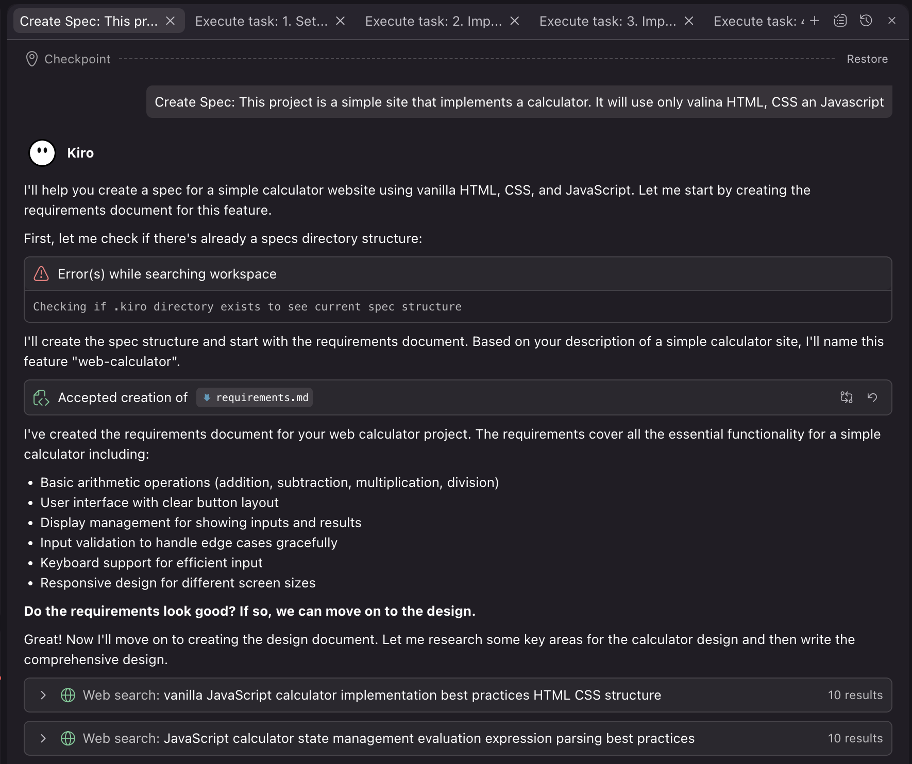
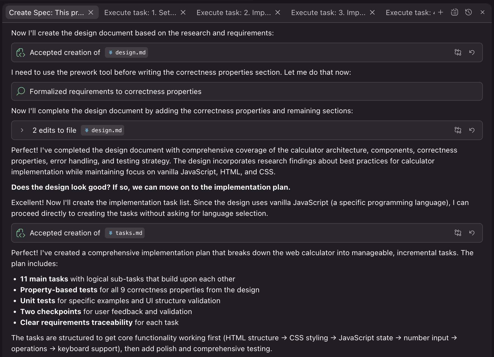
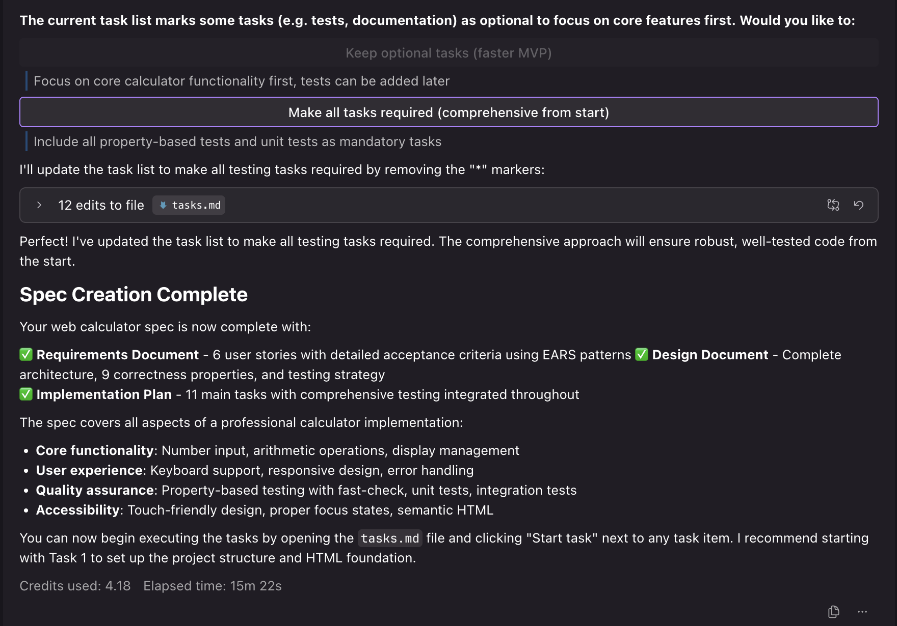
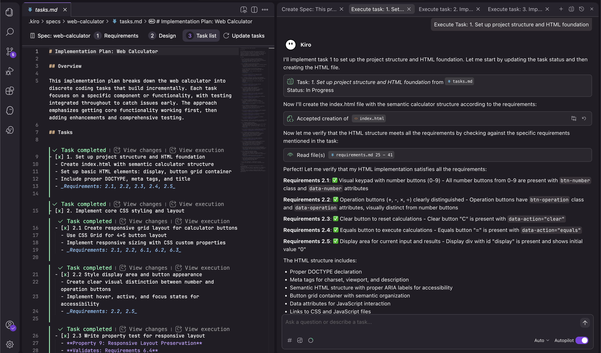
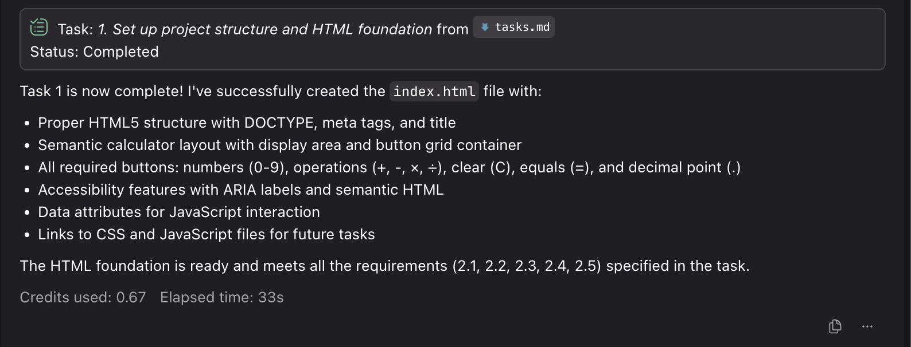

# Web Calculator

A simple, responsive web-based calculator built with vanilla HTML, CSS, and JavaScript. Performs basic arithmetic operations with a clean, intuitive interface that works across desktop and mobile devices.

## Features

- **Basic Arithmetic Operations**: Addition, subtraction, multiplication, and division
- **Responsive Design**: Works seamlessly on desktop, tablet, and mobile devices
- **Keyboard Support**: Full keyboard input support for efficient calculations
- **Error Handling**: Graceful handling of division by zero and invalid inputs
- **Accessibility**: ARIA labels and semantic HTML for screen reader compatibility
- **Touch-Friendly**: Optimized button sizes for mobile touch interfaces

## Demo

Open `index.html` in your web browser to start using the calculator.

### Alternative 
Open https://brunosouzapicinini.github.io/calculator-kiro/ 

## Development Process Documentation

This project was developed using a systematic spec-driven development approach. The following screenshots document the development process for other developers to understand the methodology:

### Specification Creation Process

The project started with a comprehensive specification creation process that included requirements gathering, design documentation, and task planning.

#### Initial Specification Documents

*Initial requirements gathering and specification structure setup*


*Design document creation with architecture and component definitions*


*Task breakdown and implementation planning with property-based testing integration*

### Task Execution Process

The implementation followed the planned tasks systematically, with each task building upon the previous ones.

#### Task Implementation

*Example of task execution showing incremental development approach*


*Property-based testing implementation and validation process*

### Development Metrics


*Resource utilization during the development process*

### Development Methodology Highlights

- **Spec-Driven Development**: Requirements → Design → Tasks → Implementation
- **Property-Based Testing**: Universal correctness properties validated with 100+ test iterations
- **Incremental Implementation**: Each task builds upon previous work
- **Comprehensive Testing**: Both unit tests and property-based tests for robust validation
- **Documentation-First**: Complete specifications before implementation begins

## Usage

### Mouse/Touch Input
- Click number buttons (0-9) to enter digits
- Click operation buttons (+, -, ×, ÷) to select operations
- Click equals (=) to calculate results
- Click clear (C) to reset the calculator

### Keyboard Input
- **Number keys (0-9)**: Enter digits
- **Operation keys (+, -, *, /)**: Select operations
- **Enter or =**: Calculate result
- **Escape or C**: Clear calculator
- **Decimal point (.)**: Add decimal point

### Example Calculations
```
5 + 3 = 8
10 - 4 = 6
7 × 6 = 42
15 ÷ 3 = 5
3.14 + 2.86 = 6
```

## Technical Details

### Architecture
- **Model-View-Controller (MVC)** pattern
- **State Management**: Centralized calculator state object
- **Event-Driven**: Responsive to both mouse and keyboard events
- **Modular Design**: Separate concerns for maintainability

### File Structure
```
/
├── index.html          # Main HTML structure
├── styles.css          # Styling and responsive design
├── calculator.js       # JavaScript logic and state management
├── calculator.test.js  # Comprehensive test suite
├── test-setup.js       # Test configuration
├── package.json        # Project dependencies
└── README.md          # This file
```

### Browser Compatibility
- Modern browsers (Chrome, Firefox, Safari, Edge)
- Mobile browsers (iOS Safari, Chrome Mobile)
- Responsive design supports viewports from 320px to 1920px

## Development

### Prerequisites
- Node.js (for running tests)
- Modern web browser

### Installation
```bash
# Clone the repository
git clone <repository-url>
cd web-calculator

# Install dependencies
npm install
```

### Running Tests
```bash
# Run all tests
npm test

# Run tests in watch mode
npm run test:watch
```

### Test Coverage
The project includes comprehensive testing:
- **29 total tests** with 100% pass rate
- **Property-based tests** using fast-check library
- **Unit tests** for specific functionality
- **Integration tests** for complete workflows
- **Error handling tests** for edge cases

### Testing Strategy
- **Property-Based Testing**: Validates universal properties across random inputs
- **Unit Testing**: Tests specific examples and edge cases
- **Integration Testing**: Tests complete user workflows
- **Accessibility Testing**: Validates ARIA labels and semantic structure

## Error Handling

The calculator gracefully handles various error conditions:

- **Division by Zero**: Displays "Error" and resets state
- **Invalid Input**: Ignores invalid keyboard inputs
- **Multiple Decimals**: Prevents multiple decimal points in one number
- **Large Numbers**: Uses scientific notation for very large results
- **Incomplete Expressions**: Handles missing operands gracefully

## Accessibility Features

- **ARIA Labels**: All buttons and display elements have descriptive labels
- **Semantic HTML**: Proper use of semantic elements and roles
- **Keyboard Navigation**: Full keyboard support for all functions
- **Screen Reader Support**: Compatible with assistive technologies
- **High Contrast**: Clear visual distinction between button types

## Responsive Design

The calculator adapts to different screen sizes:

- **Desktop**: Full-sized layout with hover effects
- **Tablet**: Optimized for touch input
- **Mobile**: Touch-friendly button sizes (minimum 44px)
- **Viewport Adaptation**: Maintains usability across all screen sizes

## Browser Support

| Browser | Version | Status |
|---------|---------|--------|
| Chrome | 60+ | ✅ Fully Supported |
| Firefox | 55+ | ✅ Fully Supported |
| Safari | 12+ | ✅ Fully Supported |
| Edge | 79+ | ✅ Fully Supported |
| iOS Safari | 12+ | ✅ Fully Supported |
| Chrome Mobile | 60+ | ✅ Fully Supported |

## Contributing

1. Fork the repository
2. Create a feature branch (`git checkout -b feature/amazing-feature`)
3. Make your changes
4. Run tests (`npm test`)
5. Commit your changes (`git commit -m 'Add amazing feature'`)
6. Push to the branch (`git push origin feature/amazing-feature`)
7. Open a Pull Request

### Development Guidelines
- Follow existing code style and patterns
- Add tests for new functionality
- Ensure all tests pass before submitting
- Update documentation as needed

### Recommended Development Process

Based on this project's successful implementation, we recommend following this spec-driven development approach:

1. **Requirements Phase**: Define clear, testable requirements using EARS patterns
2. **Design Phase**: Create comprehensive design with correctness properties
3. **Task Planning**: Break down implementation into incremental, testable tasks
4. **Implementation**: Execute tasks systematically with continuous testing
5. **Validation**: Ensure all property-based tests and unit tests pass

The documentation images in `doc/printscreen/` show this methodology in action and can serve as a reference for similar projects.

## License

This project is open source and available under the [MIT License](LICENSE).

## Acknowledgments

- Built following modern web development best practices
- Tested with property-based testing methodology
- Designed with accessibility and responsive design principles
- Implements comprehensive error handling and user experience considerations